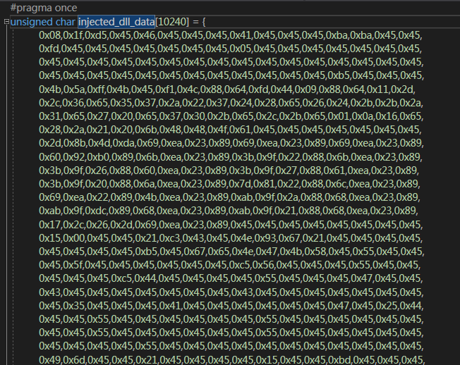

# pe_to_hex

[简体中文](README-zh.md) or [English](README.md)  

- The simple tools of make the pe file to c++ format hex code.
- if you dont want you inject dll or map driver exist in file path.
- you can make this tools to generation hex code to you code.

- arg1 : file path
- arg2 : hex code of save path

